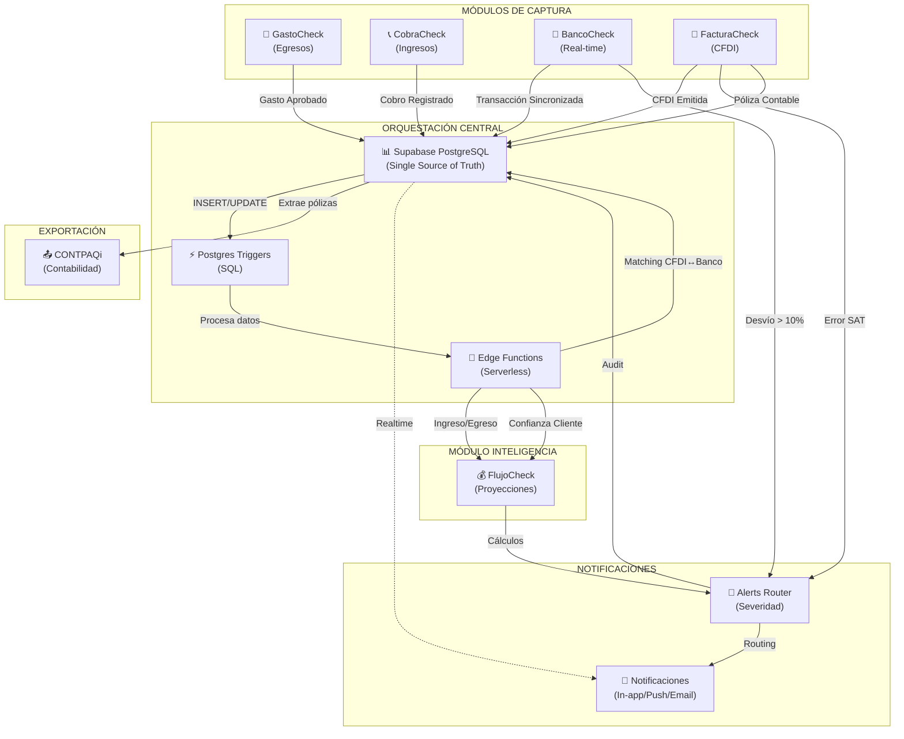

# CHECK SUITE — Diagramas de Arquitectura e Integración

**Versión:** 1.0  
**Fecha:** 2026-07-05  
**Propósito:** Visualización de flujos de datos y relaciones entre módulos  

---

## I. DIAGRAMA DE FLUJO COMPLETO (Mermaid)



---

## II. ARQUITECTURA DE CAPAS

```
┌─────────────────────────────────────────────────────────────────┐
│                     PRESENTATION LAYER                           │
│  ┌──────────────┐  ┌──────────────┐  ┌──────────────────────┐   │
│  │ GastoCheck   │  │ CobraCheck   │  │  FacturaCheck        │   │
│  │ Mobile/Web   │  │ Mobile       │  │  Web                 │   │
│  └──────────────┘  └──────────────┘  └──────────────────────┘   │
│  ┌──────────────────────────────────────────────────────────┐   │
│  │           FlujoCheck Web Dashboard                        │   │
│  │    (Proyecciones + Alertas + Analytics)                  │   │
│  └──────────────────────────────────────────────────────────┘   │
└────────────────────────┬─────────────────────────────────────────┘
                         │
                    JWT + Supabase Auth
                         │
┌────────────────────────▼─────────────────────────────────────────┐
│               BUSINESS LOGIC LAYER                               │
│  ┌────────────────┐  ┌─────────────────┐  ┌────────────────┐   │
│  │ Triggers SQL   │  │ Edge Functions  │  │ RLS Policies   │   │
│  │ • Expense→Flow │  │ • Reconciliation│  │ • Rol-based    │   │
│  │ • Cobro→Flow   │  │ • Matching      │  │ • Org-based    │   │
│  │ • Bank→Check   │  │ • Alerts Router │  │ • Data access  │   │
│  └────────────────┘  └─────────────────┘  └────────────────┘   │
└────────────────────────┬─────────────────────────────────────────┘
                         │
                   Postgres Queries
                   + Realtime PG Changes
                         │
┌────────────────────────▼─────────────────────────────────────────┐
│                   DATA LAYER                                      │
│              Supabase PostgreSQL Database                         │
│  ┌──────────────────────────────────────────────────────────┐   │
│  │ Tablas Unificadas:                                       │   │
│  │ • expenses + policy_accounts → GastoCheck               │   │
│  │ • collection_logs + payment_confidence → CobraCheck     │   │
│  │ • bank_accounts + bank_transactions → BancoCheck        │   │
│  │ • invoices + invoice_payments → FacturaCheck            │   │
│  │ • cash_flow_projections + flow_scenarios → FlujoCheck   │   │
│  │ • alerts_rules + notifications → Global                 │   │
│  └──────────────────────────────────────────────────────────┘   │
└────────────────────────┬─────────────────────────────────────────┘
                         │
         External APIs + Sync Jobs
                         │
┌────────────────────────▼─────────────────────────────────────────┐
│               EXTERNAL INTEGRATIONS                              │
│  ┌─────────────┐  ┌──────────┐  ┌─────────┐  ┌─────────────┐   │
│  │  Belvo API  │  │ FACTUROO │  │  SAT    │  │  Resend     │   │
│  │  (Bancos)   │  │  (PAC)   │  │ (Valid) │  │ (Email)     │   │
│  └─────────────┘  └──────────┘  └─────────┘  └─────────────┘   │
└─────────────────────────────────────────────────────────────────┘
```

---

## III. FLUJO DE DATOS: GASTO → FLUJO → ALERTA

```
COMPRADOR (Móvil)
    │
    ▼ Crea Gasto: $5,000 (DRAFT)
┌─────────────────────┐
│ GastoCheck          │
│ POST /expenses      │
└──────┬──────────────┘
       │
       ▼
┌─────────────────────────────────────────┐
│ SUPERVISOR (Web)                        │
│ • Revisa gasto                          │
│ • Aprueba: APPROVED                     │
└──────┬──────────────────────────────────┘
       │
       ▼
   UPDATE expenses
   SET state = 'approved'
   WHERE id = 'exp_123'
       │
       │ [TRIGGER FIRES]
       ▼
┌──────────────────────────────────┐
│ on_expense_approved              │
│                                  │
│ 1. INSERT cash_flow_projections  │
│    amount: -5000 (egreso)        │
│    date: 2026-07-10              │
│                                  │
│ 2. CALL check_cashflow_deficit() │
│    IF balance < 10000: ALERT     │
└──────┬───────────────────────────┘
       │
       ├─────────────────────────────┐
       │                             │
       ▼                             ▼
  ┌──────────────┐           ┌──────────────┐
  │ FlujoCheck   │           │ Alerts Table │
  │ Proyección   │           │ INSERT       │
  │ +$5000 egr.  │           │ CASHFLOW_    │
  │ Updated!     │           │ DEFICIT      │
  └──────────────┘           └──────┬───────┘
       │                            │
       │        ┌────────────────────┘
       │        │
       ▼        ▼
┌────────────────────────────────┐
│ Edge Function: route_alert()   │
│                                │
│ 1. Obtiene preferencias        │
│ 2. Determina canales:          │
│    • Push (severidad HIGH)     │
│    • In-app (siempre)          │
│    • Email (digerida)          │
│ 3. Envía por cada canal        │
└────────┬─────────────────────┘
         │
         ├──────────────────────────────────────┐
         │                                      │
         ▼                                      ▼
    ┌──────────────┐                  ┌───────────────────┐
    │ PUSH NOTIF   │                  │ REALTIME LISTENER │
    │              │                  │                   │
    │ Admin recibe │                  │ FlujoCheck UI     │
    │ "Déficit!    │                  │ • Refresh         │
    │ $1,500"      │                  │ • Mostrar banner  │
    │              │                  │ • Sound alert     │
    │ (vibración)  │                  └───────────────────┘
    └──────────────┘

[FIN DE FLUJO: 350ms desde aprobación]
```

---

## IV. FLUJO DE DATOS: COBRO → CONFIANZA → FLUJO

```
COBRADOR (Móvil)
    │
    ▼ Registra Cobro: $12,000
┌──────────────────────────────┐
│ CobraCheck                   │
│ POST /collection_logs        │
│ status: 'collected'          │
│ customer: 'ABC Corp'         │
└────────┬─────────────────────┘
         │
         ▼
    INSERT collection_logs
    WHERE status = 'collected'
         │
         │ [TRIGGER FIRES]
         ▼
┌────────────────────────────────────────────┐
│ on_collection_completed                    │
│                                            │
│ 1. INSERT cash_flow_projections            │
│    amount: +12000 (ingreso real)           │
│    status: 'actual'                        │
│                                            │
│ 2. UPDATE payment_confidence               │
│    confidence_score: 78% → 85%             │
│    last_payment_date: 2026-07-05           │
│                                            │
│ 3. CALL notify_flow_confidence_update()    │
└────┬──────────────────┬────────────────────┘
     │                  │
     ▼                  ▼
┌──────────────┐  ┌────────────────────────┐
│ FlujoCheck   │  │ Edge Function:         │
│ Proyección   │  │ adjust_payment_weight()│
│ +$12,000     │  │                        │
│ Updated      │  │ • ABC Corp peso: +3%  │
│              │  │ • Cobros futuros +    │
│              │  │   confianza           │
└──────────────┘  └────────────────────────┘
     │                  │
     └──────────┬───────┘
                │
                ▼
        ┌──────────────────────┐
        │ Notificación         │
        │ "Cobro registrado"   │
        │ (confianza ↑)        │
        └──────────────────────┘

[CONFIDENCE SCORE FORMULA]
success_rate = (24 - 2) / 24 = 91.7%
timeliness = 1.0 (30-day average)
volume = 1.05 ($288,000 acumulado)
SCORE = 91.7% × 1.0 × 1.05 = 96% ✓
```

---

## V. FLUJO DE DATOS: BANCO → FLUJO → ALERTA (RECONCILIACIÓN)

```
BELVO API (c/5 min)
    │
    ▼ Sincroniza transacciones
┌────────────────────────────────┐
│ BancoCheck                     │
│ bank_transactions (NEW)        │
│ amount: -$3,000                │
│ rfc_sender: "XYZ789"           │
│ date: 2026-07-05 14:35         │
└────┬───────────────────────────┘
     │
     ▼
 INSERT bank_transactions
 WHERE transaction_date = TODAY
     │
     │ [TRIGGER FIRES]
     ▼
┌──────────────────────────────────────────┐
│ reconcile_on_bank_sync()                 │
│                                          │
│ 1. SELECT SUM(amount) FROM               │
│    cash_flow_projections (FlujoCheck)    │
│    → Proyectado: $104,000                │
│                                          │
│ 2. SELECT SUM(amount) FROM               │
│    bank_transactions (Real)              │
│    → Actual: $101,200                    │
│                                          │
│ 3. Calcula desviación:                   │
│    |104k - 101.2k| / 104k = 2.7%         │
│                                          │
│ 4. Compara vs umbral (10%):              │
│    2.7% < 10% → OK ✓                     │
│                                          │
│ 5. INSERT bank_reconciliation            │
│    status: 'OK'                          │
└──────────────────────────────────────────┘

SI DESVIACIÓN > 10%:
    │
    ▼
┌────────────────────────────────┐
│ INSERT alerts_rules            │
│ type: 'BANK_DEVIATION'         │
│ severity: 'HIGH'               │
│ message: "Desvío 12.5%"        │
└────┬───────────────────────────┘
     │
     ▼
┌────────────────────────────────────────┐
│ route_alert()                          │
│                                        │
│ Envía:                                 │
│ • Push Notification (Admin)            │
│ • Email (Supervisor)                   │
│ • In-app Alert (FlujoCheck)            │
└────────────────────────────────────────┘
```

---

## VI. FLUJO DE DATOS: CFDI → MATCHING → PÓLIZA

```
ADMIN (Web)
    │
    ▼ Emite CFDI en FacturaCheck
┌──────────────────────────────────┐
│ FacturaCheck                     │
│ POST /invoices                   │
│ folio: 'FAC_2026_001'            │
│ rfc_receiver: 'AAA123456XYZ'     │
│ amount: $15,000                  │
│ status: 'CREATED'                │
└────┬─────────────────────────────┘
     │
     ▼ (Valida con SAT/FACTUROO)
 CFDI Status: 'VALID'
 UUID: [uuid-string]
     │
     ▼
UPDATE invoices
SET state = 'paid',
    sat_status = 'VALID'
     │
     │ [TRIGGER FIRES]
     ▼
┌──────────────────────────────────────────┐
│ sync_invoice_payment_to_bank()           │
│                                          │
│ 1. INSERT bank_reconciliation            │
│    status: 'PENDING_BANK_MATCH'          │
│    expected_amount: $15,000              │
│    rfc_receiver: 'AAA123456XYZ'          │
│                                          │
│ 2. INSERT notifications                 │
│    "Pago registrado. Esperando banco"    │
│                                          │
│ 3. CREATE POLICY (trigger secundario)    │
│    póliza: 'POL_JULIO_001'               │
│    • Banco (D): 15,000                   │
│    • Ventas (H): 15,000                  │
└────┬──────────────────────────────────────┘
     │
     ├──────────────────────┐
     │                      │
     ▼                      ▼
 4 DÍAS DESPUÉS...   [GastoCheck]
                    Nueva póliza
 Belvo sincroniza   importada
 nueva transacción
     │
     ▼
┌──────────────────────────────┐
│ BancoCheck                   │
│ Transacción Nueva:           │
│ RFC: 'AAA123456XYZ' (match!) │
│ Monto: $15,000 (exacto!)     │
│ Fecha: 2026-07-04 (±2 días)  │
└────┬─────────────────────────┘
     │
     ▼
┌──────────────────────────────────────┐
│ auto_match_bank_transactions()       │
│                                      │
│ Búsqueda:                            │
│ • RFC coincide: ✓                    │
│ • Monto exacto: ✓                    │
│ • Fecha dentro ±2 días: ✓            │
│                                      │
│ UPDATE bank_reconciliation           │
│ status: 'MATCHED'                    │
│ matched_at: 2026-07-04 10:15         │
└────┬──────────────────────┬──────────┘
     │                      │
     ▼                      ▼
 [FlujoCheck]          [Notificación]
 Marca ingreso         "CFDI FAC_2026_001
 'actual'              reconciliada ✓"
 No más 'proyectado'
```

---

## VII. MATRIZ DE ALERTAS POR MÓDULO

```
MÓDULO          EVENTO                    SEVERIDAD  CANAL              DESTINATARIO
────────────────────────────────────────────────────────────────────────────────────
GastoCheck      Gasto Aprobado            INFO       In-app             Supervisor
                Póliza Enviada            WARNING    In-app + Email     Contador
                Rechazo de Gasto          WARNING    In-app + Push      Comprador

CobraCheck      Cobro Registrado          INFO       In-app             Cobrador
                Pago Fallido              HIGH       Push + Email       Cobrador
                Confianza ↓ 20%           WARNING    In-app             Admin

BancoCheck      Sincronización OK         INFO       (silent)           -
                Sincronización Error      HIGH       Email              Admin
                Desvío > 10%              HIGH       Push + Email       Admin
                Anomalía detectada        CRITICAL   Push + SMS         Admin

FacturaCheck    CFDI Creada               INFO       In-app             Admin
                CFDI Validada (SAT)       INFO       (silent)           -
                Error SAT                 CRITICAL   Push + Email       Admin
                Pago Registrado           INFO       In-app             Admin

FlujoCheck      Déficit < umbral          HIGH       Push + Email       Admin
                Superávit > límite        WARNING    In-app             Admin
                Proyección Actualizada    INFO       Realtime           User
                Escenario Cambiado        WARNING    In-app             User

────────────────────────────────────────────────────────────────────────────────────
GLOBAL          RECONCILIACIÓN MATCHED    INFO       In-app             Admin
                RECONCILIACIÓN FAIL       HIGH       Push + Email       Admin
                EXPORTACIÓN CONTPAQi OK   INFO       In-app             Contador
```

---

## VIII. CICLO DE INTEGRACIÓN DIARIA

```
┌─────────────────────────────────────────────────────────────────────┐
│                     CICLO DE UN DÍA EN CHECK SUITE                  │
└─────────────────────────────────────────────────────────────────────┘

8:00 AM ─────────────────────────────────────────────────────────────
│  Cron Job: generate_daily_digest()
│  ├─ Agrega alertas de las últimas 24h
│  ├─ Genera reporte HTML
│  └─ Envía email a cada admin/contador
│

9:00 AM ─────────────────────────────────────────────────────────────
│  COMPRADOR se abre GastoCheck (móvil)
│  ├─ Registra gastos de ayer
│  ├─ Estado: DRAFT
│  └─ Envía a SUPERVISOR para aprobación
│

10:00 AM ────────────────────────────────────────────────────────────
│  SUPERVISOR revisa GastoCheck (web)
│  ├─ Ve todos los gastos SUBMITTED
│  ├─ Aprueba gastos válidos
│  └─ [TRIGGER FIRES] → Aparecen en FlujoCheck
│

11:00 AM ────────────────────────────────────────────────────────────
│  BELVO API: Sincronización de bancos (#1)
│  ├─ Trae transacciones últimas 2 horas
│  ├─ [TRIGGER FIRES] → Reconciliación vs FlujoCheck
│  └─ Si desvío > 10%: ALERTA
│

2:00 PM ─────────────────────────────────────────────────────────────
│  COBRADOR abre CobraCheck (móvil)
│  ├─ Registra cobros del día
│  ├─ Actualiza payment_confidence
│  └─ [TRIGGER FIRES] → FlujoCheck actualiza pesos
│

4:00 PM ─────────────────────────────────────────────────────────────
│  ADMIN emite facturas en FacturaCheck (web)
│  ├─ Crea CFDI
│  ├─ Valida con SAT/FACTUROO
│  ├─ Marca como PAID
│  └─ [TRIGGER FIRES] → Crea póliza automática
│

5:00 PM ─────────────────────────────────────────────────────────────
│  CONTADOR accede a GastoCheck (web)
│  ├─ Revisa todas las pólizas
│  ├─ Reconcilia vs facturas
│  └─ Exporta a CONTPAQi
│

6:00 PM ─────────────────────────────────────────────────────────────
│  BELVO API: Sincronización de bancos (#2)
│  ├─ Trae transacciones del día
│  ├─ [TRIGGER FIRES] → auto_match_bank_transactions()
│  └─ Reconcilia CFDI emitidas vs transacciones reales
│

7:00 PM ─────────────────────────────────────────────────────────────
│  ADMIN abre FlujoCheck dashboard
│  ├─ Ve proyección semanal actualizada
│  ├─ Alertas activas resumidas
│  ├─ Confiabilidad clientes por pesar
│  └─ Próximos 7 días: saldo esperado
│

8:00 PM ─────────────────────────────────────────────────────────────
│  Cron Job: check_reconciliation_status()
│  ├─ Busca PENDING_BANK_MATCH > 3 días
│  ├─ Si sin matching: ALERT "Posible error SAT"
│  └─ Log audit
│

[DIARIAMENTE SE PROPAGAN]:
✓ 5-10 gastos aprobados
✓ 10-20 cobros registrados
✓ 50-100 transacciones bancarias sincronizadas
✓ 3-5 CFDI emitidas
✓ 1 exportación CONTPAQi
✓ 0-3 alertas críticas

[LATENCIAS GARANTIZADAS]:
├─ Gasto → FlujoCheck: < 1s
├─ Cobro → FlujoCheck: < 1s
├─ Banco sync: 5 min (por diseño)
├─ Matching CFDI: < 30s
├─ Email digest: < 5s
└─ Alerta crítica: < 5s
```

---

## IX. TABLA DE RELACIONES DE BASES DE DATOS

```
┌────────────────────────────────────────────────────────────────────┐
│                   SUPABASE SCHEMA UNIFICADO                         │
└────────────────────────────────────────────────────────────────────┘

PUBLIC SCHEMA:
├── organizations (PK: id)
│   └─ org_id → org_members → auth_users
│
├── [GastoCheck Module]
│   ├── expenses (PK: id, FK: org_id)
│   │   └─ payment_date, amount, state, created_by
│   ├── policies (PK: id, FK: org_id)
│   │   └─ date, status, description, reference
│   ├── policy_accounts (PK: id, FK: policy_id)
│   │   └─ account_number, debit, credit
│   └── expense_attachments
│       └─ receipt_url, validation_status
│
├── [CobraCheck Module]
│   ├── credits (PK: id, FK: org_id)
│   │   └─ customer_id, amount, due_date
│   ├── collection_logs (PK: id, FK: org_id)
│   │   └─ cobrador_id, customer_id, amount, status
│   ├── payment_confidence (PK: id, FK: org_id)
│   │   └─ customer_id, confidence_score, last_payment_date
│   ├── daily_routes (PK: id, FK: org_id)
│   │   └─ cobrador_id, date, route_data (JSON)
│   └── route_stops
│       └─ customer_id, address, scheduled_time
│
├── [BancoCheck Module]
│   ├── bank_accounts (PK: id, FK: org_id)
│   │   └─ bank_code, account_number, balance_current
│   ├── bank_transactions (PK: id, FK: account_id)
│   │   └─ transaction_date, amount, rfc_sender/receiver
│   ├── bank_reconciliation (PK: id, FK: org_id)
│   │   └─ status, expected_amount, actual_amount, matched_at
│   └── transaction_anomalies (PK: id)
│       └─ anomaly_type, confidence, action_taken
│
├── [FacturaCheck Module]
│   ├── invoices (PK: id, FK: org_id)
│   │   └─ folio_number, rfc_receiver, amount, sat_status, uuid
│   ├── invoice_items (PK: id, FK: invoice_id)
│   │   └─ description, quantity, unit_price
│   ├── invoice_payments (PK: id, FK: invoice_id)
│   │   └─ payment_date, amount, payment_method
│   ├── invoice_to_policy (PK: id)
│   │   └─ invoice_id, policy_id, sat_status, contpaq_exported
│   └── invoice_attachments
│       └─ cfdi_xml_url, pac_receipt_url
│
├── [FlujoCheck Module]
│   ├── cash_flow_projections (PK: id, FK: org_id)
│   │   └─ date, amount, type, module, status
│   ├── flow_scenarios (PK: id, FK: org_id)
│   │   └─ name, baseline, optimistic, pessimistic
│   ├── flow_alerts (PK: id, FK: org_id)
│   │   └─ type, triggered_date, resolved_date
│   └── confidence_weights (PK: id, FK: org_id)
│       └─ customer_id, weight_pct, last_updated
│
└── [Global/Audit]
    ├── alerts_rules (PK: id, FK: org_id)
    │   └─ type, severity, module, triggered_at, data (JSON)
    ├── notifications (PK: id, FK: org_id)
    │   └─ user_id, type, channel, read, sent_at
    ├── notification_preferences (PK: id, FK: org_id)
    │   └─ role, high_severity_push, daily_digest_time
    ├── audit_logs (PK: id, FK: org_id)
    │   └─ action, user_id, table_name, changes (JSON)
    └── org_settings (PK: id, FK: org_id)
        └─ config (JSON): cashflow_threshold, bank_deviation_threshold, etc.


FK RELATIONSHIPS:
expenses.org_id → organizations.id
expenses.created_by → auth_users.id

collection_logs.org_id → organizations.id
collection_logs.cobrador_id → auth_users.id
collection_logs.customer_id → credits.customer_id

payment_confidence.customer_id → [external]

cash_flow_projections.org_id → organizations.id

alerts_rules.org_id → organizations.id
notifications.org_id → organizations.id
notifications.user_id → auth_users.id


TRIGGERS (SQL):
1. on_expense_approved
   WHEN: expenses.state = 'approved'
   THEN: INSERT cash_flow_projections

2. on_collection_completed
   WHEN: collection_logs.status = 'collected'
   THEN: INSERT cash_flow_projections + UPDATE payment_confidence

3. reconcile_on_bank_sync
   WHEN: INSERT bank_transactions
   THEN: INSERT bank_reconciliation + check deviation

4. on_invoice_payment_recorded
   WHEN: INSERT invoice_payments
   THEN: INSERT bank_reconciliation (PENDING_BANK_MATCH)

5. on_invoice_validated_and_paid
   WHEN: UPDATE invoices (sat_status = 'VALID', state = 'paid')
   THEN: CREATE policy + INSERT policy_accounts

6. auto_match_bank_transactions
   WHEN: Cron daily (6pm)
   THEN: UPDATE bank_reconciliation (PENDING → MATCHED)
```

---

## X. FLUJO DE PERMISOS POR ROL

```
┌──────────────────────────────────────────────────────────────────┐
│              RLS POLICIES MATRIZ DE ACCESO                        │
└──────────────────────────────────────────────────────────────────┘

TABLA: expenses
├─ ROLE: buyer (COMPRADOR)
│  ├─ SELECT: Solo propios (created_by = auth.uid())
│  ├─ INSERT: Propia organización (org_id = org_user.org_id)
│  ├─ UPDATE: Solo DRAFT y SUBMITTED
│  └─ DELETE: Solo DRAFT
│
├─ ROLE: contador_general (SUPERVISOR)
│  ├─ SELECT: Todos en la organización
│  ├─ INSERT: No
│  ├─ UPDATE: state SUBMITTED → APPROVED/REJECTED
│  └─ DELETE: No
│
└─ ROLE: admin
   ├─ SELECT: Todos
   ├─ INSERT: Todos
   ├─ UPDATE: Todos
   └─ DELETE: Todos


TABLA: collection_logs
├─ ROLE: cobrador (COLLECTION AGENT)
│  ├─ SELECT: Solo propios (cobrador_id = auth.uid())
│  ├─ INSERT: Solo propios
│  ├─ UPDATE: Propios + status
│  └─ DELETE: No
│
├─ ROLE: contador_general (SUPERVISOR)
│  ├─ SELECT: Todos
│  ├─ INSERT: No
│  ├─ UPDATE: Solo reportes
│  └─ DELETE: No
│
└─ ROLE: admin
   ├─ SELECT: Todos
   ├─ INSERT: No
   ├─ UPDATE: Todos
   └─ DELETE: Todos


TABLA: bank_transactions
├─ ROLE: cobrador (COLLECTION AGENT)
│  ├─ SELECT: Solo saldos (summary)
│  ├─ INSERT: No
│  ├─ UPDATE: No
│  └─ DELETE: No
│
├─ ROLE: contador_general (SUPERVISOR)
│  ├─ SELECT: Todos
│  ├─ INSERT: No
│  ├─ UPDATE: No
│  └─ DELETE: No
│
└─ ROLE: admin
   ├─ SELECT: Todos
   ├─ INSERT: No (API externa)
   ├─ UPDATE: No (API externa)
   └─ DELETE: No


TABLA: invoices
├─ ROLE: cobrador (COLLECTION AGENT)
│  ├─ SELECT: Ninguno
│  ├─ INSERT: No
│  ├─ UPDATE: No
│  └─ DELETE: No
│
├─ ROLE: contador_general (SUPERVISOR)
│  ├─ SELECT: Todos
│  ├─ INSERT: No
│  ├─ UPDATE: No (API FACTUROO)
│  └─ DELETE: No
│
└─ ROLE: admin
   ├─ SELECT: Todos
   ├─ INSERT: Todos
   ├─ UPDATE: Todos
   └─ DELETE: No (archived)


TABLA: cash_flow_projections
├─ ROLE: cobrador (COLLECTION AGENT)
│  ├─ SELECT: Ninguno
│  ├─ INSERT: No
│  ├─ UPDATE: No
│  └─ DELETE: No
│
├─ ROLE: contador_general (SUPERVISOR)
│  ├─ SELECT: Todos
│  ├─ INSERT: No (automático)
│  ├─ UPDATE: No (automático)
│  └─ DELETE: No
│
└─ ROLE: admin
   ├─ SELECT: Todos
   ├─ INSERT: No (automático)
   ├─ UPDATE: No (automático)
   └─ DELETE: No (audit)


TABLA: alerts_rules
├─ ROLE: cobrador (COLLECTION AGENT)
│  ├─ SELECT: Solo suyas (recipient_role = 'cobrador')
│  ├─ INSERT: No
│  ├─ UPDATE: No
│  └─ DELETE: No
│
├─ ROLE: contador_general (SUPERVISOR)
│  ├─ SELECT: Suyas + admin
│  ├─ INSERT: No
│  ├─ UPDATE: No
│  └─ DELETE: No
│
└─ ROLE: admin
   ├─ SELECT: Todos
   ├─ INSERT: No (automático)
   ├─ UPDATE: No (automático)
   └─ DELETE: No (audit)


[RESUMEN VISIBILIDAD]
┌─────────────────────┬─────────┬────────────┬──────────┬────────┐
│ TABLA               │ COMPRADOR│ SUPERVISOR │ COBRADOR │ ADMIN  │
├─────────────────────┼─────────┼────────────┼──────────┼────────┤
│ expenses            │  Propios│ Todos      │ Ninguno  │ Todos  │
│ collection_logs     │ Ninguno │ Todos      │ Propios  │ Todos  │
│ bank_transactions   │ Ninguno │ Todos      │ Resumen  │ Todos  │
│ invoices            │ Ninguno │ Todos      │ Ninguno  │ Todos  │
│ cash_flow_projections│ Ninguno│ Todos      │ Ninguno  │ Todos  │
│ alerts_rules        │ Suyos   │ Suyos+Adm  │ Suyos    │ Todos  │
│ payment_confidence  │ Ninguno │ Todos      │ Resumen  │ Todos  │
└─────────────────────┴─────────┴────────────┴──────────┴────────┘
```

---

**Documento Técnico:** CHECK SUITE Integración  
**Última Actualización:** 2026-07-05  
**Próxima Revisión:** 2026-07-12  
